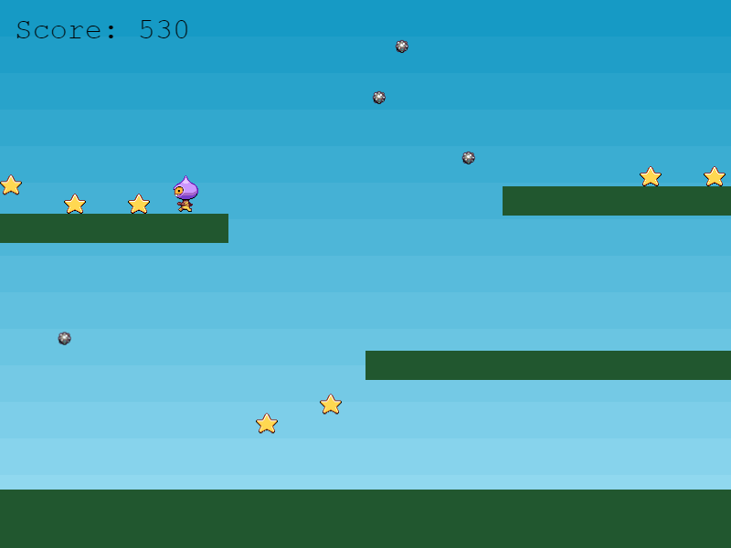

# Phaser 3 Tutorial Game

The game from [Phaser's official version 3
tutorial](http://phaser.io/tutorials/making-your-first-phaser-3-game/part1),
bundled using Vite with code linting from ESLint and Prettier.



## Installing

Clone this repository

```sh
git clone https://github.com/travishorn/phaser-3-tutorial-game
```

Change into the directory

```sh
cd phaser-3-tutorial-game
```

Install dependencies

```sh
npm install
```

## Running

Run the development server

```sh
npm run dev
```

The hot-reloadable project is served and accessible via your browser.

## Linting

Lint all files

```sh
npm run lint
```

Lint and attempt to automatically fix issues

```sh
npm run lint:fix
```

## Deploying

Build the project

```sh
npm run build
```

Serve the built files in `./dist` using a static file server of your choosing.

## License

Honestly, I'm not sure. The online tutorial is copyright Photon Storm Ltd. All
Rights Reserved. And I'm unsure if that includes the actual code that you're
meant to copy. I also cannot find the exact tutorial project's source code
hosted on their GitHub. However, many of their other repositories are licensed
under the MIT or ISC license.

The parts of this repository that you cannot find on the online tutorial have
been coded by myself and are licensed under the MIT license. This would include
configuration for ESLint and refactored code for Vite compatibility.

The MIT License (MIT)

Copyright © 2023 Travis Horn

Permission is hereby granted, free of charge, to any person obtaining a copy of
this software and associated documentation files (the “Software”), to deal in
the Software without restriction, including without limitation the rights to
use, copy, modify, merge, publish, distribute, sublicense, and/or sell copies of
the Software, and to permit persons to whom the Software is furnished to do so,
subject to the following conditions:

The above copyright notice and this permission notice shall be included in all
copies or substantial portions of the Software.

THE SOFTWARE IS PROVIDED “AS IS”, WITHOUT WARRANTY OF ANY KIND, EXPRESS OR
IMPLIED, INCLUDING BUT NOT LIMITED TO THE WARRANTIES OF MERCHANTABILITY, FITNESS
FOR A PARTICULAR PURPOSE AND NONINFRINGEMENT. IN NO EVENT SHALL THE AUTHORS OR
COPYRIGHT HOLDERS BE LIABLE FOR ANY CLAIM, DAMAGES OR OTHER LIABILITY, WHETHER
IN AN ACTION OF CONTRACT, TORT OR OTHERWISE, ARISING FROM, OUT OF OR IN
CONNECTION WITH THE SOFTWARE OR THE USE OR OTHER DEALINGS IN THE SOFTWARE.
